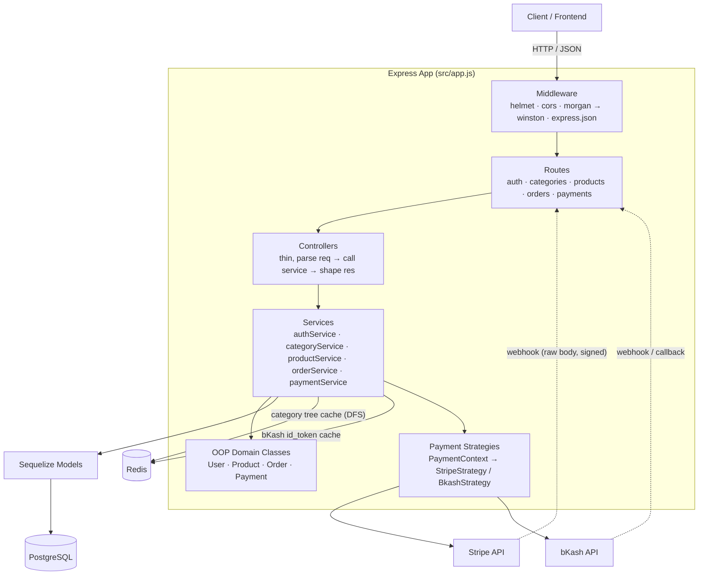

# System Architecture

## Layered request flow

Every request follows the same strict path: **routes → controllers → services → models**. Controllers never touch Sequelize models directly, services never touch `req`/`res`. This keeps business logic testable in isolation from HTTP concerns.

## Why each layer exists

| Layer | Responsibility | Example |
|---|---|---|
| **Routes** | URL → middleware chain wiring only, no logic | `src/routes/order.routes.js` |
| **Middlewares** | Cross-cutting concerns: auth, validation, error handling | `requireAuth`, `validate(schema)`, `errorHandler` |
| **Controllers** | Translate HTTP ↔ service calls, no business rules | `src/controllers/payment.controller.js` |
| **Services** | Business logic, transactions, orchestration | `src/services/paymentService.js` |
| **OOP Domain Classes** | Encapsulate entity behavior (hashing, stock math, status checks) — required by assessment 2.2.1 | `src/classes/{User,Product,Order,Payment}.js` |
| **Strategies** | Interchangeable payment-provider behavior — required by assessment 2.2.4 | `src/strategies/{PaymentStrategy,StripeStrategy,BkashStrategy,PaymentContext}.js` |
| **Models** | Sequelize ORM mapping, associations only | `models/*.js` |

## Redis usage (two distinct caches)

1. **Category tree cache** (`categories:forest`) — the entire category hierarchy is built once via DFS and cached for 1 hour, invalidated on any category write. Powers the `/products/:id/related` DFS recommendation without repeated recursive DB queries (assessment 2.2.5).
2. **bKash token cache** (`bkash:id_token`) — the bKash OAuth-style `id_token` is cached until shortly before it expires, avoiding a token grant call on every single bKash request.

## Error handling

A single central `errorHandler` middleware (last in the chain) formats every error response as `{ success: false, error: { message, details? } }`. All async route handlers are wrapped in `asyncHandler` so rejected promises are always forwarded to it — nothing can crash the process from within a request.

## Security

- Passwords hashed with bcrypt (`User` class), never stored or returned in plain text.
- JWT-based auth (`requireAuth`), role-based guard (`requireAdmin`) for admin-only routes.
- Stripe webhook signatures verified via `stripe.webhooks.constructEvent` against the raw request body (mounted with `express.raw()` **before** the global JSON parser — a common integration mistake this project avoids).
- bKash webhook payloads are never trusted directly — the backend re-queries bKash for the authoritative status before acting on any callback.
- Secrets loaded exclusively from `.env` (see `.env.example`), never hardcoded.
