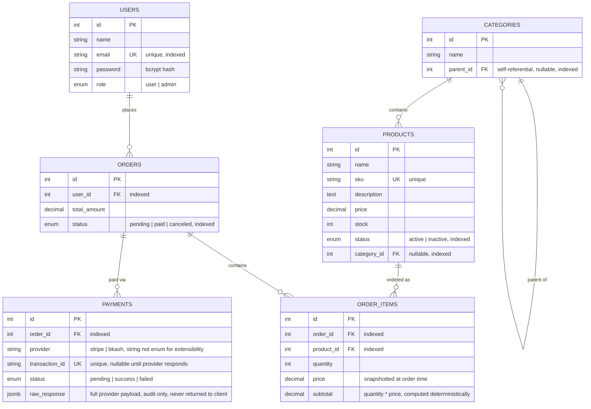

# Entity Relationship Diagram

## Notes on deliberate design choices

- **`Categories.parent_id` is self-referential** with `ON DELETE CASCADE` — deleting a parent category removes its entire subtree. This is what the DFS traversal (assessment 2.2.5) walks.
- **`Products.category_id`** uses `ON DELETE SET NULL` — deleting a category never deletes products, it just uncategorizes them.
- **`OrderItems.product_id`** uses `ON DELETE RESTRICT` — a product referenced by any existing order can no longer be deleted outright (enforced at the DB level, surfaced as a clean `409` at the service layer).
- **`Payments.provider` is a plain string, not a Postgres enum.** Adding a new payment provider later (e.g. `paddle`, `paypal`) only requires a new strategy class + one line in the factory, never an `ALTER TYPE` migration.
- **`OrderItems.price` is a snapshot**, not a live reference to `Products.price` — so a later price change never retroactively alters historical orders.
