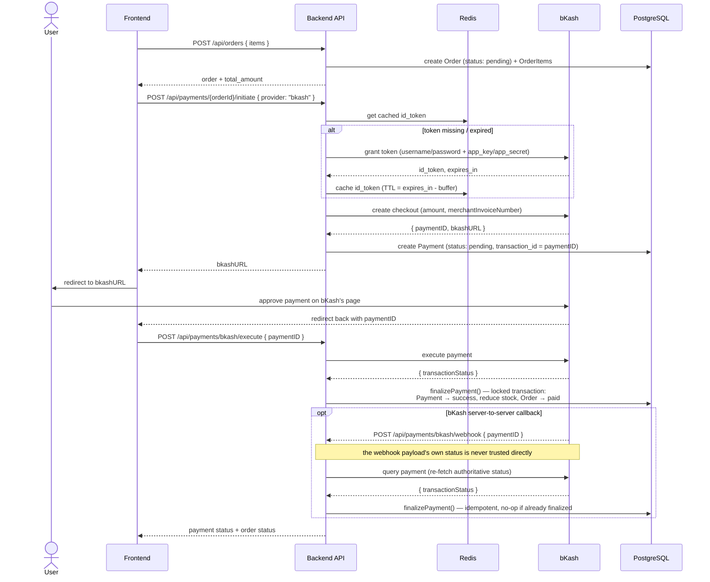

# bKash Payment Flow

## Key implementation details

- **bKash sandbox callbacks aren't cryptographically signed** the way Stripe's are, so the webhook handler never trusts the callback body's status field — it always calls bKash's own `query payment` API to get the authoritative status before finalizing anything (`paymentService.handleBkashWebhook`).
- **The `id_token` is cached in Redis**, not re-requested on every API call, since bKash's grant token is valid for a fixed lifetime (typically ~1 hour). The cache TTL is set a little shorter than the real expiry as a safety buffer.
- **`execute` and the webhook both funnel into the same `finalizePayment()`** used by the Stripe flow — this is the payoff of the strategy pattern: one shared, well-tested finalization path regardless of which provider triggered it.
- Same guarantees as Stripe: stock reduced only on success, everything in one transaction, failed payments leave the order `pending` for retry.
