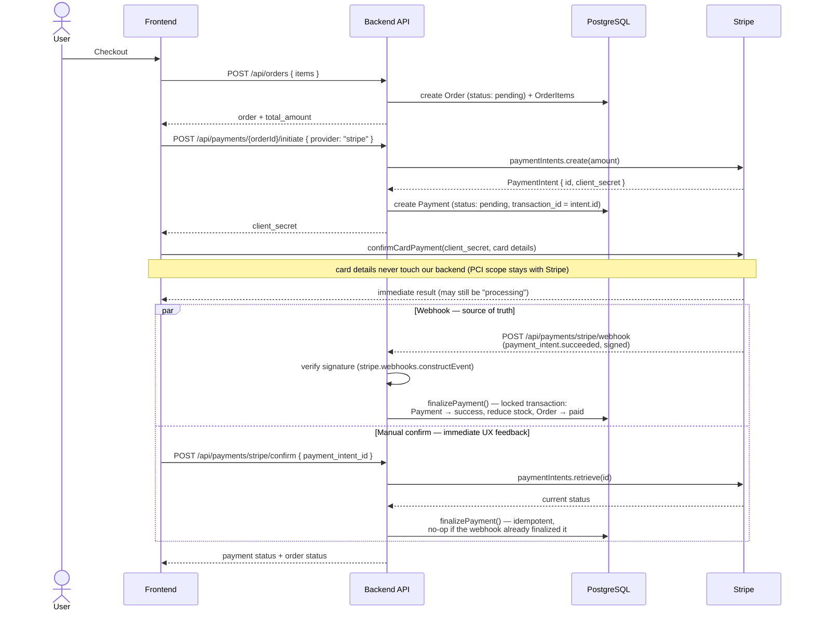

# Stripe Payment Flow

## Key implementation details

- **The webhook route is mounted with `express.raw({ type: 'application/json' })`, before the global `express.json()` middleware.** Stripe signature verification needs the exact raw request bytes — if the body had already been parsed to a JS object, the signature check would always fail. This is a common integration bug this project deliberately avoids (`src/routes/paymentWebhook.routes.js`, mounted early in `src/app.js`).
- **Both paths call the same `finalizePayment()`.** Whichever arrives first (webhook or manual confirm) does the real work; the second call is a safe no-op because the payment row is locked (`SELECT ... FOR UPDATE`) and its status is checked before any write.
- **Stock is only reduced on success**, inside the same DB transaction as the status update and the order status change — all three succeed together or all three roll back together.
- **A failed payment leaves the order `pending`**, not `canceled`, so the customer can retry with the same or a different provider instead of losing their order over one declined card.
